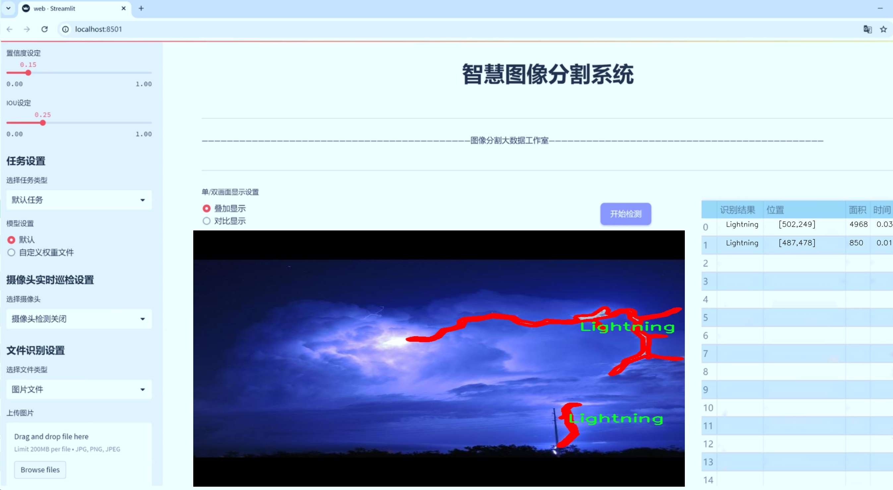
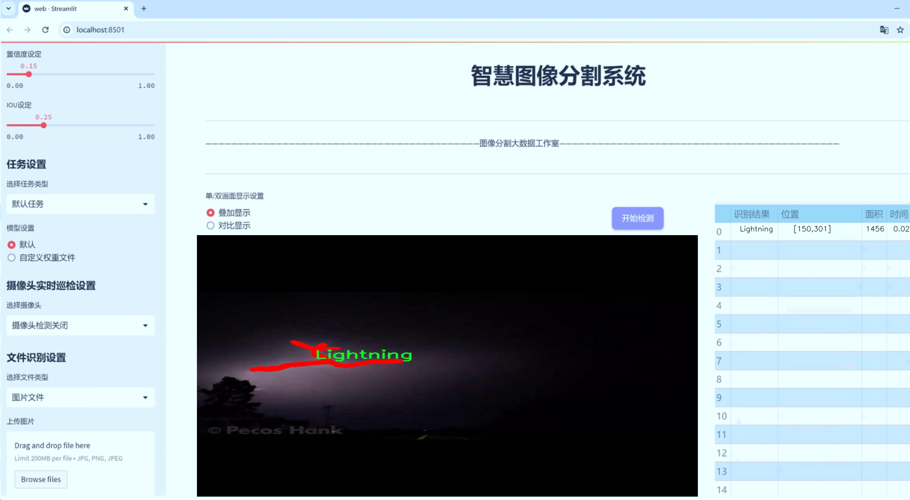
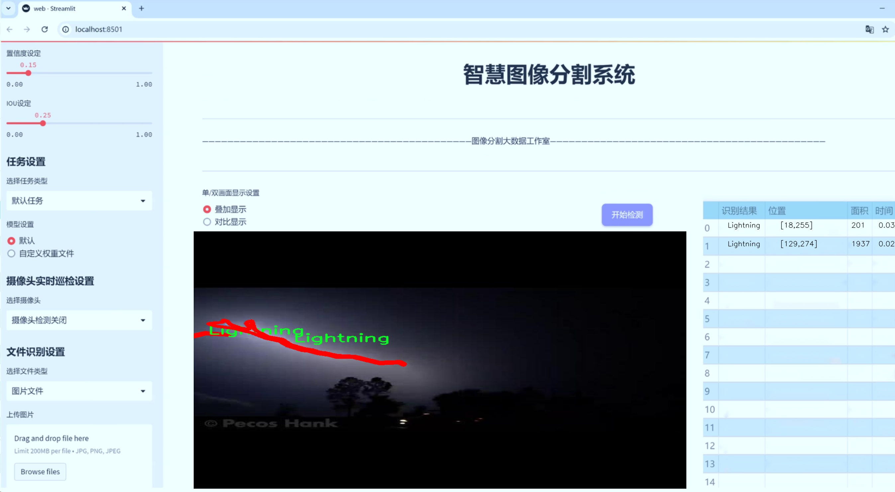
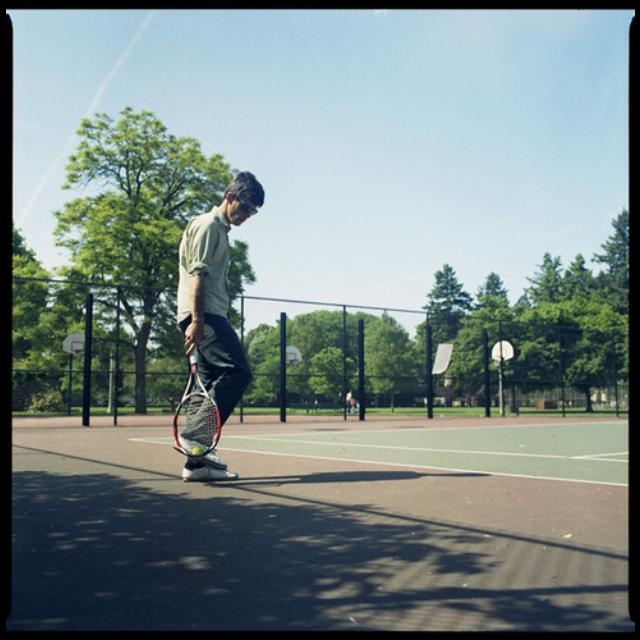

# 闪电图像分割系统： yolov8-seg-C2f-ContextGuided

### 1.研究背景与意义

[参考博客](https://gitee.com/YOLOv8_YOLOv11_Segmentation_Studio/projects)

[博客来源](https://kdocs.cn/l/cszuIiCKVNis)

研究背景与意义

随着气候变化的加剧，极端天气事件的频率和强度不断增加，闪电作为一种常见的自然现象，正受到越来越多的关注。闪电不仅对生态环境和气候系统产生深远影响，还对人类社会的安全和基础设施构成威胁。因此，准确识别和分析闪电图像对于气象学、环境科学以及灾害预警等领域具有重要的实际意义。然而，传统的图像处理方法在处理复杂背景和多变光照条件下的闪电图像时，往往难以达到理想的效果。基于深度学习的图像分割技术，尤其是实例分割技术，近年来在计算机视觉领域取得了显著进展，成为解决此类问题的有效工具。

本研究旨在基于改进的YOLOv8模型，构建一个高效的闪电图像分割系统。YOLO（You Only Look Once）系列模型以其实时性和高精度而闻名，适用于多种目标检测和分割任务。通过对YOLOv8进行改进，我们希望能够提高其在闪电图像分割中的表现，尤其是在处理背景复杂、光照变化大的图像时。该系统将利用1400张闪电图像进行训练，数据集中包含两个类别，其中一个类别为闪电。这一数据集的构建为研究提供了丰富的样本，能够有效支持模型的训练和验证。

闪电图像分割系统的意义不仅体现在学术研究上，更在于其广泛的应用前景。首先，该系统可以为气象部门提供实时的闪电监测和分析工具，帮助气象学家更好地理解闪电的形成机制及其对气候的影响。其次，在灾害预警方面，准确的闪电检测和定位可以为相关部门提供及时的信息，减少闪电引发的火灾和其他安全事故的风险。此外，该系统还可以为环境保护和生态研究提供数据支持，帮助科学家评估闪电对生态系统的影响。

综上所述，基于改进YOLOv8的闪电图像分割系统不仅在技术上具有创新性和实用性，还在社会和环境层面具有重要的应用价值。通过本研究，我们希望能够推动闪电图像处理技术的发展，为相关领域的研究提供新的思路和方法。同时，这一研究也为深度学习在自然现象监测中的应用提供了新的示范，促进了计算机视觉技术与气象科学的交叉融合。

### 2.图片演示







注意：本项目提供完整的训练源码数据集和训练教程,由于此博客编辑较早,暂不提供权重文件（best.pt）,需要按照6.训练教程进行训练后实现上图效果。

### 3.视频演示

[3.1 视频演示](https://www.bilibili.com/video/BV18LzhYrExW/)

### 4.数据集信息

##### 4.1 数据集类别数＆类别名

nc: 1
names: ['Lightning']


##### 4.2 数据集信息简介

数据集信息展示

在本研究中，我们使用了名为“lightning_seg”的数据集，以支持对改进YOLOv8-seg模型的闪电图像分割系统的训练和评估。该数据集专门针对闪电现象的图像分割任务而设计，旨在为深度学习模型提供高质量的训练样本，以提升其在实际应用中的表现。数据集的类别数量为1，类别列表中仅包含“Lightning”这一类，表明该数据集的重点是对闪电图像的精准识别与分割。

“lightning_seg”数据集的构建过程涉及了多种图像采集技术和数据增强方法，以确保模型在不同环境和条件下的鲁棒性。数据集中的图像来源于多种气象条件下的闪电现象，包括晴天、阴天、雷雨等多种天气场景，确保模型能够学习到闪电在不同背景下的特征。此外，数据集中还包含了多种不同的拍摄角度和距离，以增强模型对闪电形态变化的适应能力。

在数据预处理阶段，我们对图像进行了标准化处理，包括尺寸调整、颜色归一化等，以便于模型的输入要求。同时，为了提高模型的泛化能力，我们还应用了数据增强技术，如随机裁剪、旋转、翻转等，增加了数据集的多样性。这些处理措施旨在减少模型对特定图像特征的依赖，使其能够更好地适应实际应用中的各种变化。

数据集的标注工作由经验丰富的气象学专家和计算机视觉领域的研究人员共同完成，确保了标注的准确性和一致性。每张图像中的闪电区域都经过精确的分割，形成了高质量的标注数据。这些标注不仅包括闪电的轮廓信息，还涵盖了闪电的亮度和形状特征，为模型的训练提供了丰富的上下文信息。

在模型训练过程中，我们将“lightning_seg”数据集分为训练集、验证集和测试集，以便于对模型的性能进行全面评估。训练集用于模型的学习，验证集用于调优模型参数，而测试集则用于最终的性能评估。通过这种划分，我们能够有效地监控模型在不同阶段的学习效果，并根据验证集的表现不断优化模型架构和训练策略。

总之，“lightning_seg”数据集为改进YOLOv8-seg的闪电图像分割系统提供了坚实的基础。通过对闪电现象的专门设计和高质量的标注，该数据集不仅增强了模型的学习能力，还提升了其在实际应用中的准确性和可靠性。随着对该数据集的深入研究，我们期待能够在闪电图像分割领域取得更为显著的进展，为相关气象研究和应用提供有力支持。





### 5.项目依赖环境部署教程（零基础手把手教学）

[5.1 环境部署教程链接（零基础手把手教学）](https://www.bilibili.com/video/BV1jG4Ve4E9t/?vd_source=bc9aec86d164b67a7004b996143742dc)


[5.2 安装Python虚拟环境创建和依赖库安装视频教程链接（零基础手把手教学）](https://www.bilibili.com/video/BV1nA4VeYEze/?vd_source=bc9aec86d164b67a7004b996143742dc)

### 6.手把手YOLOV8-seg训练视频教程（零基础手把手教学）

[6.1 手把手YOLOV8-seg训练视频教程（零基础小白有手就能学会）](https://www.bilibili.com/video/BV1cA4VeYETe/?vd_source=bc9aec86d164b67a7004b996143742dc)


按照上面的训练视频教程链接加载项目提供的数据集，运行train.py即可开始训练



     Epoch   gpu_mem       box       obj       cls    labels  img_size
     1/200     0G   0.01576   0.01955  0.007536        22      1280: 100%|██████████| 849/849 [14:42<00:00,  1.04s/it]
               Class     Images     Labels          P          R     mAP@.5 mAP@.5:.95: 100%|██████████| 213/213 [01:14<00:00,  2.87it/s]
                 all       3395      17314      0.994      0.957      0.0957      0.0843

     Epoch   gpu_mem       box       obj       cls    labels  img_size
     2/200     0G   0.01578   0.01923  0.007006        22      1280: 100%|██████████| 849/849 [14:44<00:00,  1.04s/it]
               Class     Images     Labels          P          R     mAP@.5 mAP@.5:.95: 100%|██████████| 213/213 [01:12<00:00,  2.95it/s]
                 all       3395      17314      0.996      0.956      0.0957      0.0845

     Epoch   gpu_mem       box       obj       cls    labels  img_size
     3/200     0G   0.01561    0.0191  0.006895        27      1280: 100%|██████████| 849/849 [10:56<00:00,  1.29it/s]
               Class     Images     Labels          P          R     mAP@.5 mAP@.5:.95: 100%|███████   | 187/213 [00:52<00:00,  4.04it/s]
                 all       3395      17314      0.996      0.957      0.0957      0.0845


### 7.50+种全套YOLOV8-seg创新点加载调参实验视频教程（一键加载写好的改进模型的配置文件）

[7.1 50+种全套YOLOV8-seg创新点加载调参实验视频教程（一键加载写好的改进模型的配置文件）](https://www.bilibili.com/video/BV1Hw4VePEXv/?vd_source=bc9aec86d164b67a7004b996143742dc)

### YOLOV8-seg算法简介

原始YOLOv8-seg算法原理

YOLOv8-seg算法是目标检测和实例分割领域的一项重要进展，由Glenn-Jocher提出，作为YOLO系列模型的最新版本，它在多个方面对前辈模型进行了优化和改进。YOLOv8-seg不仅继承了YOLOv5的优良设计，还融合了YOLOv6和YOLOX的创新元素，使其在精度和效率上都表现出色。其核心原理可以从数据预处理、骨干网络结构、特征融合、检测头设计和标签分配策略等多个方面进行深入分析。

首先，在数据预处理阶段，YOLOv8-seg延续了YOLOv5的增强策略，采用了马赛克增强、混合增强、空间扰动和颜色扰动等多种手段。这些数据增强技术不仅提高了模型的鲁棒性，还有效扩展了训练数据的多样性，帮助模型更好地适应不同的场景和目标。这种预处理方式使得YOLOv8-seg在面对复杂背景和多样化目标时，能够保持较高的检测精度。

接下来，YOLOv8-seg的骨干网络结构是其性能提升的关键所在。与YOLOv5相似，YOLOv8-seg采用了C2f模块来替代之前的C3模块，C2f模块通过引入更多的分支和跳层连接，丰富了特征的表达能力。这种设计不仅增强了梯度的流动性，还提高了特征提取的效率。C2f模块的深度参数经过精心设计，能够根据不同规模的模型进行灵活调整，从而实现对不同任务的适应性。

在特征融合方面，YOLOv8-seg依然采用了FPN（特征金字塔网络）和PAN（路径聚合网络）结构。这种结构能够有效地融合来自不同尺度的特征图，确保模型在处理多尺度目标时，能够充分利用不同层次的信息。通过FPN-PAN结构，YOLOv8-seg能够在保持高效计算的同时，提升对小目标和复杂场景的检测能力。

YOLOv8-seg的检测头设计也体现了其创新性。与之前的耦合检测头不同，YOLOv8-seg采用了解耦头结构，将分类和定位任务分开处理。这种设计使得模型在进行目标检测时，能够更专注于各自的任务，从而提高了整体的检测精度。此外，YOLOv8-seg引入了Anchor-Free的检测方式，省去了传统的锚框设计，简化了模型的复杂性，并提高了对不同形状和尺寸目标的适应能力。

在标签分配策略方面，YOLOv8-seg采用了动态标签分配策略，借鉴了YOLOv6的TOOD方法。这种策略通过实时分析目标的特征和分布，动态调整正负样本的匹配方式，避免了传统方法中由于数据集不足而导致的候选框不准确问题。YOLOv8-seg的损失函数设计也经过了优化，分类损失采用了Varifocal Loss，回归损失则结合了CIoULoss与DFLLoss。这种损失函数的设计使得模型在训练过程中能够更好地聚焦于高质量的正样本，同时有效降低负样本对损失的影响，从而提升了模型的整体性能。

YOLOv8-seg的另一个显著特点是其对高分辨率图像和小目标的支持。通过对模型结构的优化，YOLOv8-seg能够在处理高分辨率图像时，保持较高的检测精度和速度。这一特性使得YOLOv8-seg在实际应用中，能够广泛适用于城市监控、自动驾驶、医学影像等多个领域。

总的来说，YOLOv8-seg算法在原有YOLO系列的基础上，通过多方面的创新和改进，形成了一种高效、准确的目标检测与实例分割解决方案。其在数据预处理、骨干网络、特征融合、检测头设计和标签分配策略等方面的优化，使得YOLOv8-seg在计算机视觉领域中占据了重要地位。随着技术的不断发展，YOLOv8-seg无疑将为更多的实际应用场景提供强有力的支持，推动目标检测和实例分割技术的进一步发展。


### 9.系统功能展示（检测对象为举例，实际内容以本项目数据集为准）

图9.1.系统支持检测结果表格显示

  图9.2.系统支持置信度和IOU阈值手动调节

  图9.3.系统支持自定义加载权重文件best.pt(需要你通过步骤5中训练获得)

  图9.4.系统支持摄像头实时识别

  图9.5.系统支持图片识别

  图9.6.系统支持视频识别

  图9.7.系统支持识别结果文件自动保存

  图9.8.系统支持Excel导出检测结果数据


### 10.50+种全套YOLOV8-seg创新点原理讲解（非科班也可以轻松写刊发刊，V11版本正在科研待更新）

#### 10.1 由于篇幅限制，每个创新点的具体原理讲解就不一一展开，具体见下列网址中的创新点对应子项目的技术原理博客网址【Blog】：


[10.1 50+种全套YOLOV8-seg创新点原理讲解链接](https://gitee.com/qunmasj/good)

#### 10.2 部分改进模块原理讲解(完整的改进原理见上图和技术博客链接)【如果此小节的图加载失败可以通过CSDN或者Github搜索该博客的标题访问原始博客，原始博客图片显示正常】

### YOLOv8简介

按照官方描述，YOLOv8 是一个 SOTA 模型，它建立在以前 YOLO 版本的成功基础上，并引入了新的功能和改进，以进一步提升性能和灵活性。具体创新包括一个新的骨干网络、一个新的 Ancher-Free 检测头和一个新的损失函数，可以在从 CPU 到 GPU 的各种硬件平台上运行。

不过 ultralytics 并没有直接将开源库命名为 YOLOv8，而是直接使用 ultralytics 这个词，原因是 ultralytics 将这个库定位为算法框架，而非某一个特定算法，一个主要特点是可扩展性。其希望这个库不仅仅能够用于 YOLO 系列模型，而是能够支持非 YOLO 模型以及分类分割姿态估计等各类任务。
总而言之，ultralytics 开源库的两个主要优点是：

融合众多当前 SOTA 技术于一体
未来将支持其他 YOLO 系列以及 YOLO 之外的更多算法


下表为官方在 COCO Val 2017 数据集上测试的 mAP、参数量和 FLOPs 结果。可以看出 YOLOv8 相比 YOLOv5 精度提升非常多，但是 N/S/M 模型相应的参数量和 FLOPs 都增加了不少，从上图也可以看出相比 YOLOV5 大部分模型推理速度变慢了。


额外提一句，现在各个 YOLO 系列改进算法都在 COCO 上面有明显性能提升，但是在自定义数据集上面的泛化性还没有得到广泛验证，至今依然听到不少关于 YOLOv5 泛化性能较优异的说法。对各系列 YOLO 泛化性验证也是 MMYOLO 中一个特别关心和重点发力的方向。

### YOLO-MS简介
实时目标检测，以YOLO系列为例，已在工业领域中找到重要应用，特别是在边缘设备（如无人机和机器人）中。与之前的目标检测器不同，实时目标检测器旨在在速度和准确性之间追求最佳平衡。为了实现这一目标，提出了大量的工作：从第一代DarkNet到CSPNet，再到最近的扩展ELAN，随着性能的快速增长，实时目标检测器的架构经历了巨大的变化。

尽管性能令人印象深刻，但在不同尺度上识别对象仍然是实时目标检测器面临的基本挑战。这促使作者设计了一个强大的编码器架构，用于学习具有表现力的多尺度特征表示。具体而言，作者从两个新的角度考虑为实时目标检测编码多尺度特征：

从局部视角出发，作者设计了一个具有简单而有效的分层特征融合策略的MS-Block。受到Res2Net的启发，作者在MS-Block中引入了多个分支来进行特征提取，但不同的是，作者使用了一个带有深度卷积的 Inverted Bottleneck Block块，以实现对大Kernel的高效利用。

从全局视角出发，作者提出随着网络加深逐渐增加卷积的Kernel-Size。作者在浅层使用小Kernel卷积来更高效地处理高分辨率特征。另一方面，在深层中，作者采用大Kernel卷积来捕捉广泛的信息。

基于以上设计原则，作者呈现了作者的实时目标检测器，称为YOLO-MS。为了评估作者的YOLO-MS的性能，作者在MS COCO数据集上进行了全面的实验。还提供了与其他最先进方法的定量比较，以展示作者方法的强大性能。如图1所示，YOLO-MS在计算性能平衡方面优于其他近期的实时目标检测器。


具体而言，YOLO-MS-XS在MS COCO上获得了43%+的AP得分，仅具有450万个可学习参数和8.7亿个FLOPs。YOLO-MS-S和YOLO-MS分别获得了46%+和51%+的AP，可学习参数分别为810万和2220万。此外，作者的工作还可以作为其他YOLO模型的即插即用模块。通常情况下，作者的方法可以将YOLOv8的AP从37%+显著提高到40%+，甚至还可以使用更少的参数和FLOPs。


#### Multi-Scale Building Block Design
CSP Block是一个基于阶段级梯度路径的网络，平衡了梯度组合和计算成本。它是广泛应用于YOLO系列的基本构建块。已经提出了几种变体，包括YOLOv4和YOLOv5中的原始版本，Scaled YOLOv4中的CSPVoVNet，YOLOv7中的ELAN，以及RTMDet中提出的大Kernel单元。作者在图2(a)和图2(b)中分别展示了原始CSP块和ELAN的结构。


上述实时检测器中被忽视的一个关键方面是如何在基本构建块中编码多尺度特征。其中一个强大的设计原则是Res2Net，它聚合了来自不同层次的特征以增强多尺度表示。然而，这一原则并没有充分探索大Kernel卷积的作用，而大Kernel卷积已经在基于CNN的视觉识别任务模型中证明有效。将大Kernel卷积纳入Res2Net的主要障碍在于它们引入的计算开销，因为构建块采用了标准卷积。在作者的方法中，作者提出用 Inverted Bottleneck Block替代标准的3 × 3卷积，以享受大Kernel卷积的好处。

基于前面的分析，作者提出了一个带有分层特征融合策略的全新Block，称为MS-Block，以增强实时目标检测器在提取多尺度特征时的能力，同时保持快速的推理速度。

MS-Block的具体结构如图2(c)所示。假设是输入特征。通过1×1卷积的转换后，X的通道维度增加到n*C。然后，作者将X分割成n个不同的组，表示为，其中。为了降低计算成本，作者选择n为3。

注意，除了之外，每个其他组都经过一个 Inverted Bottleneck Block层，用表示，其中k表示Kernel-Size，以获得。的数学表示如下：


根据这个公式，该博客的作者不将 Inverted Bottleneck Block层连接，使其作为跨阶段连接，并保留来自前面层的信息。最后，作者将所有分割连接在一起，并应用1×1卷积来在所有分割之间进行交互，每个分割都编码不同尺度的特征。当网络加深时，这个1×1卷积也用于调整通道数。

#### Heterogeneous Kernel Selection Protocol
除了构建块的设计外，作者还从宏观角度探讨了卷积的使用。之前的实时目标检测器在不同的编码器阶段采用了同质卷积（即具有相同Kernel-Size的卷积），但作者认为这不是提取多尺度语义信息的最佳选项。

在金字塔结构中，从检测器的浅阶段提取的高分辨率特征通常用于捕捉细粒度语义，将用于检测小目标。相反，来自网络较深阶段的低分辨率特征用于捕捉高级语义，将用于检测大目标。如果作者在所有阶段都采用统一的小Kernel卷积，深阶段的有效感受野（ERF）将受到限制，影响大目标的性能。在每个阶段中引入大Kernel卷积可以帮助解决这个问题。然而，具有大的ERF的大Kernel可以编码更广泛的区域，这增加了在小目标外部包含噪声信息的概率，并且降低了推理速度。

在这项工作中，作者建议在不同阶段中采用异构卷积，以帮助捕获更丰富的多尺度特征。具体来说，在编码器的第一个阶段中，作者采用最小Kernel卷积，而最大Kernel卷积位于最后一个阶段。随后，作者逐步增加中间阶段的Kernel-Size，使其与特征分辨率的增加保持一致。这种策略允许提取细粒度和粗粒度的语义信息，增强了编码器的多尺度特征表示能力。

正如图所示，作者将k的值分别分配给编码器中的浅阶段到深阶段，取值为3、5、7和9。作者将其称为异构Kernel选择（HKS）协议。


作者的HKS协议能够在深层中扩大感受野，而不会对浅层产生任何其他影响。此外，HKS不仅有助于编码更丰富的多尺度特征，还确保了高效的推理。

如表1所示，将大Kernel卷积应用于高分辨率特征会产生较高的计算开销。然而，作者的HKS协议在低分辨率特征上采用大Kernel卷积，从而与仅使用大Kernel卷积相比，大大降低了计算成本。


在实践中，作者经验性地发现，采用HKS协议的YOLO-MS的推理速度几乎与仅使用深度可分离的3 × 3卷积相同。

#### Architecture
如图所示，作者模型的Backbone由4个阶段组成，每个阶段后面跟随1个步长为2的3 × 3卷积进行下采样。在第3个阶段后，作者添加了1个SPP块，与RTMDet中一样。在作者的编码器上，作者使用PAFPN作为Neck来构建特征金字塔[31, 35]。它融合了从Backbone不同阶段提取的多尺度特征。Neck中使用的基本构建块也是作者的MS-Block，在其中使用3 × 3深度可分离卷积进行快速推理。

此外，为了在速度和准确性之间取得更好的平衡，作者将Backbone中多级特征的通道深度减半。作者提供了3个不同尺度的YOLO-MS变体，即YOLO-MS-XS、YOLO-MS-S和YOLO-MS。不同尺度的YOLO-MS的详细配置列在表2中。对于YOLO-MS的其他部分，作者将其保持与RTMDet相同。


### 11.项目核心源码讲解（再也不用担心看不懂代码逻辑）

#### 11.1 ultralytics\models\rtdetr\val.py

以下是经过简化和注释的核心代码部分，保留了RTDETRDataset和RTDETRValidator类的主要功能，并对每个方法进行了详细的中文注释。

```python
# 导入必要的库
from pathlib import Path
import torch
from ultralytics.data import YOLODataset
from ultralytics.models.yolo.detect import DetectionValidator
from ultralytics.utils import ops

class RTDETRDataset(YOLODataset):
    """
    实时检测与跟踪 (RT-DETR) 数据集类，继承自基础的 YOLODataset 类。
    该类专为 RT-DETR 目标检测模型设计，优化了实时检测和跟踪任务。
    """

    def __init__(self, *args, data=None, **kwargs):
        """初始化 RTDETRDataset 类，继承自 YOLODataset 类。"""
        super().__init__(*args, data=data, use_segments=False, use_keypoints=False, **kwargs)

    def load_image(self, i, rect_mode=False):
        """从数据集中加载索引为 'i' 的图像，返回 (im, resized hw)。"""
        return super().load_image(i=i, rect_mode=rect_mode)

    def build_transforms(self, hyp=None):
        """构建数据增强变换，主要用于评估阶段。"""
        if self.augment:
            # 根据增强条件设置马赛克和混合增强参数
            hyp.mosaic = hyp.mosaic if self.augment and not self.rect else 0.0
            hyp.mixup = hyp.mixup if self.augment and not self.rect else 0.0
            transforms = v8_transforms(self, self.imgsz, hyp, stretch=True)
        else:
            transforms = Compose([])  # 不进行任何变换

        # 添加格式化变换
        transforms.append(
            Format(bbox_format='xywh',
                   normalize=True,
                   return_mask=self.use_segments,
                   return_keypoint=self.use_keypoints,
                   batch_idx=True,
                   mask_ratio=hyp.mask_ratio,
                   mask_overlap=hyp.overlap_mask))
        return transforms


class RTDETRValidator(DetectionValidator):
    """
    RTDETRValidator 扩展了 DetectionValidator 类，提供专门针对 RT-DETR 模型的验证功能。
    该类允许构建 RTDETR 特定的数据集进行验证，应用非极大值抑制进行后处理，并相应更新评估指标。
    """

    def build_dataset(self, img_path, mode='val', batch=None):
        """
        构建 RTDETR 数据集。

        参数:
            img_path (str): 包含图像的文件夹路径。
            mode (str): 模式 ('train' 或 'val')，用户可以为每种模式自定义不同的增强。
            batch (int, optional): 批量大小，适用于 'rect' 模式。默认为 None。
        """
        return RTDETRDataset(
            img_path=img_path,
            imgsz=self.args.imgsz,
            batch_size=batch,
            augment=False,  # 不进行增强
            hyp=self.args,
            rect=False,  # 不使用矩形模式
            cache=self.args.cache or None,
            prefix=colorstr(f'{mode}: '),
            data=self.data)

    def postprocess(self, preds):
        """对预测输出应用非极大值抑制。"""
        bs, _, nd = preds[0].shape  # bs: 批量大小, nd: 预测维度
        bboxes, scores = preds[0].split((4, nd - 4), dim=-1)  # 分离边界框和分数
        bboxes *= self.args.imgsz  # 缩放边界框
        outputs = [torch.zeros((0, 6), device=bboxes.device)] * bs  # 初始化输出

        for i, bbox in enumerate(bboxes):  # 遍历每个边界框
            bbox = ops.xywh2xyxy(bbox)  # 转换边界框格式
            score, cls = scores[i].max(-1)  # 获取最大分数和对应类别
            pred = torch.cat([bbox, score[..., None], cls[..., None]], dim=-1)  # 合并边界框、分数和类别
            pred = pred[score.argsort(descending=True)]  # 按分数排序
            outputs[i] = pred  # 保存预测结果

        return outputs

    def update_metrics(self, preds, batch):
        """更新评估指标。"""
        for si, pred in enumerate(preds):
            idx = batch['batch_idx'] == si  # 获取当前批次的索引
            cls = batch['cls'][idx]  # 获取当前批次的类别
            bbox = batch['bboxes'][idx]  # 获取当前批次的边界框
            nl, npr = cls.shape[0], pred.shape[0]  # 标签数量和预测数量
            shape = batch['ori_shape'][si]  # 原始图像形状
            correct_bboxes = torch.zeros(npr, self.niou, dtype=torch.bool, device=self.device)  # 初始化正确边界框

            self.seen += 1  # 增加已处理的批次数

            if npr == 0:  # 如果没有预测
                if nl:
                    self.stats.append((correct_bboxes, *torch.zeros((2, 0), device=self.device), cls.squeeze(-1)))
                continue

            # 处理预测
            if self.args.single_cls:
                pred[:, 5] = 0  # 如果是单类检测，设置类别为0
            predn = pred.clone()  # 克隆预测
            predn[..., [0, 2]] *= shape[1] / self.args.imgsz  # 转换为原始空间预测
            predn[..., [1, 3]] *= shape[0] / self.args.imgsz  # 转换为原始空间预测

            # 评估
            if nl:
                tbox = ops.xywh2xyxy(bbox)  # 转换目标边界框格式
                tbox[..., [0, 2]] *= shape[1]  # 转换为原始空间
                tbox[..., [1, 3]] *= shape[0]  # 转换为原始空间
                labelsn = torch.cat((cls, tbox), 1)  # 合并标签和目标边界框
                correct_bboxes = self._process_batch(predn.float(), labelsn)  # 处理批次
            self.stats.append((correct_bboxes, pred[:, 4], pred[:, 5], cls.squeeze(-1)))  # 更新统计信息

            # 保存预测结果
            if self.args.save_json:
                self.pred_to_json(predn, batch['im_file'][si])
            if self.args.save_txt:
                file = self.save_dir / 'labels' / f'{Path(batch["im_file"][si]).stem}.txt'
                self.save_one_txt(predn, self.args.save_conf, shape, file)
```

### 代码说明：
1. **RTDETRDataset**: 该类负责加载和处理RT-DETR模型所需的数据集。它扩展了YOLODataset类，并实现了图像加载和数据增强的方法。
2. **RTDETRValidator**: 该类负责验证RT-DETR模型的性能，包括构建数据集、后处理预测结果和更新评估指标。它实现了非极大值抑制和评估逻辑，以确保模型的预测结果准确。

每个方法都有详细的中文注释，帮助理解其功能和实现逻辑。

这个文件 `ultralytics/models/rtdetr/val.py` 是用于验证 RT-DETR（实时检测与跟踪）模型的实现。它主要包含两个类：`RTDETRDataset` 和 `RTDETRValidator`，分别用于数据集的构建和模型验证的过程。

首先，`RTDETRDataset` 类继承自 `YOLODataset`，它专门为 RT-DETR 模型设计，优化了实时检测和跟踪任务。该类的构造函数调用了父类的构造函数，并且设置了一些特定的参数，如不使用分段和关键点。它重写了 `load_image` 方法，以加载指定索引的图像，并返回图像及其调整后的尺寸。此外，`build_transforms` 方法用于构建数据增强的转换操作，如果启用了增强，则使用 `v8_transforms` 进行处理，否则返回一个空的转换列表。最终，它会添加一个格式化的转换，以便于后续处理。

接下来是 `RTDETRValidator` 类，它继承自 `DetectionValidator`，提供了针对 RT-DETR 模型的验证功能。这个类允许构建特定于 RT-DETR 的数据集，并在后处理阶段应用非极大值抑制（NMS），以更新评估指标。`build_dataset` 方法用于构建 RT-DETR 数据集，接收图像路径、模式（训练或验证）和批量大小等参数。该方法返回一个 `RTDETRDataset` 实例。

在 `postprocess` 方法中，对模型的预测结果应用非极大值抑制，处理后得到的边界框和分数会被整理成适合后续评估的格式。`update_metrics` 方法则负责更新评估指标，它会根据预测结果和真实标签计算正确的边界框，并更新统计信息。该方法还处理了绘制混淆矩阵的逻辑，并根据需要将预测结果保存为 JSON 或 TXT 格式。

总体而言，这个文件实现了 RT-DETR 模型在验证阶段的核心功能，包括数据集的构建、预测结果的后处理以及评估指标的更新，旨在为模型的性能评估提供支持。

#### 11.2 ultralytics\trackers\utils\__init__.py

当然可以！以下是代码的核心部分，并附上详细的中文注释：

```python
# Ultralytics YOLO 🚀, AGPL-3.0 license

# 这是一个使用Ultralytics YOLO模型的代码片段
# YOLO（You Only Look Once）是一种用于目标检测的深度学习模型

# 导入必要的库
import torch  # 导入PyTorch库，用于深度学习
from models.experimental import attempt_load  # 从模型库中导入尝试加载模型的函数
from utils.datasets import LoadImages  # 导入图像加载工具
from utils.general import check_img_size, non_max_suppression  # 导入一些通用工具函数

# 加载YOLO模型
model = attempt_load('yolov5s.pt', map_location='cuda:0')  # 加载预训练的YOLOv5s模型到GPU

# 设置输入图像的大小
img_size = check_img_size(640)  # 检查并设置图像大小为640

# 加载图像数据
dataset = LoadImages('data/images', img_size=img_size)  # 从指定路径加载图像数据

# 进行目标检测
for path, img, im0s, vid_cap in dataset:  # 遍历数据集中的每一张图像
    img = torch.from_numpy(img).to('cuda:0')  # 将图像转换为Tensor并移动到GPU
    img = img.float() / 255.0  # 将图像归一化到[0, 1]范围

    # 进行推理
    pred = model(img[None], augment=False)[0]  # 使用模型进行推理，返回预测结果

    # 应用非极大值抑制（NMS）来过滤重叠的检测框
    pred = non_max_suppression(pred, conf_thres=0.25, iou_thres=0.45)  # 设置置信度阈值和IOU阈值

    # 处理检测结果
    for det in pred:  # 遍历每个检测结果
        if det is not None and len(det):  # 检查检测结果是否有效
            # 处理检测框（例如绘制框、显示标签等）
            pass  # 此处可以添加代码来处理检测结果
```

### 注释说明：
1. **导入库**：导入了PyTorch和一些YOLO模型及工具函数，以便进行模型加载、图像处理和目标检测。
2. **加载模型**：使用`attempt_load`函数加载预训练的YOLOv5s模型，并将其放置在GPU上以加速计算。
3. **设置图像大小**：使用`check_img_size`函数确保输入图像的大小符合模型要求。
4. **加载图像数据**：通过`LoadImages`函数从指定路径加载图像数据，准备进行目标检测。
5. **目标检测过程**：遍历每张图像，进行预处理（如归一化），然后使用模型进行推理。
6. **非极大值抑制**：使用`non_max_suppression`函数过滤掉重叠的检测框，以提高检测结果的准确性。
7. **处理检测结果**：对有效的检测结果进行后续处理（如绘制检测框、显示标签等），此处可以根据需要添加具体实现。

这个文件是Ultralytics YOLO项目的一部分，主要用于目标检测和跟踪。文件名为`__init__.py`，通常在Python包中用于标识该目录为一个包，并可以包含初始化代码或导入其他模块。

文件的开头包含一行注释，表明该项目使用的是AGPL-3.0许可证，这是一种开源许可证，允许用户自由使用、修改和分发软件，但要求任何基于该软件的衍生作品也必须以相同的许可证发布。

在`__init__.py`文件中，通常会有一些导入语句，以便在包被导入时自动加载某些模块或功能。虽然具体的代码没有提供，但可以推测该文件可能会包含与目标跟踪相关的工具函数、类或其他模块的导入，以便用户可以方便地使用这些功能。

总的来说，这个文件是Ultralytics YOLO项目的一部分，旨在为目标跟踪提供必要的工具和功能，同时遵循开源许可证的规定。

#### 11.3 ultralytics\utils\files.py

以下是代码中最核心的部分，并附上详细的中文注释：

```python
import os
from pathlib import Path
from contextlib import contextmanager

@contextmanager
def spaces_in_path(path):
    """
    处理路径中包含空格的上下文管理器。如果路径包含空格，则将其替换为下划线，
    复制文件/目录到新路径，执行上下文代码块，然后将文件/目录复制回原位置。

    参数:
        path (str | Path): 原始路径。

    生成:
        (Path): 如果路径中有空格，则返回替换了下划线的临时路径，否则返回原始路径。
    """
    # 如果路径中有空格，将其替换为下划线
    if ' ' in str(path):
        path = Path(path)  # 确保路径是Path对象

        # 创建一个临时目录并构造新的路径
        with tempfile.TemporaryDirectory() as tmp_dir:
            tmp_path = Path(tmp_dir) / path.name.replace(' ', '_')

            # 复制文件/目录
            if path.is_dir():
                shutil.copytree(path, tmp_path)  # 复制目录
            elif path.is_file():
                shutil.copy2(path, tmp_path)  # 复制文件

            try:
                # 返回临时路径
                yield tmp_path
            finally:
                # 将文件/目录复制回原位置
                if tmp_path.is_dir():
                    shutil.copytree(tmp_path, path, dirs_exist_ok=True)
                elif tmp_path.is_file():
                    shutil.copy2(tmp_path, path)  # 复制回文件
    else:
        # 如果没有空格，直接返回原始路径
        yield path


def increment_path(path, exist_ok=False, sep='', mkdir=False):
    """
    增加文件或目录路径，即将路径后面加上一个数字，形成新的路径。

    如果路径存在且exist_ok未设置为True，则通过在路径末尾附加数字和分隔符来增加路径。
    如果路径是文件，则保留文件扩展名；如果路径是目录，则直接在路径末尾附加数字。
    如果mkdir设置为True，则如果路径不存在，则创建该路径。

    参数:
        path (str, pathlib.Path): 要增加的路径。
        exist_ok (bool, optional): 如果为True，则路径不会增加，直接返回原路径。默认为False。
        sep (str, optional): 路径和增加数字之间使用的分隔符。默认为''。
        mkdir (bool, optional): 如果路径不存在，则创建目录。默认为False。

    返回:
        (pathlib.Path): 增加后的路径。
    """
    path = Path(path)  # 处理平台无关的路径
    if path.exists() and not exist_ok:
        path, suffix = (path.with_suffix(''), path.suffix) if path.is_file() else (path, '')

        # 增加路径
        for n in range(2, 9999):
            p = f'{path}{sep}{n}{suffix}'  # 增加路径
            if not os.path.exists(p):  # 如果路径不存在
                break
        path = Path(p)

    if mkdir:
        path.mkdir(parents=True, exist_ok=True)  # 创建目录

    return path
```

### 代码核心部分说明：
1. **`spaces_in_path` 函数**：这是一个上下文管理器，用于处理路径中包含空格的情况。它会在执行代码块前将路径中的空格替换为下划线，并在代码块执行后将文件或目录复制回原位置。

2. **`increment_path` 函数**：这个函数用于增加文件或目录的路径。如果指定的路径已经存在，它会在路径后面附加一个数字（如 `path/exp2`），以确保返回的路径是唯一的。可以选择创建目录。

这两个函数是文件和目录管理中非常实用的工具，能够帮助处理路径中的特殊情况。

这个程序文件 `ultralytics/utils/files.py` 主要包含了一些用于文件和目录操作的工具函数和上下文管理器，特别是在处理路径、文件大小、文件日期等方面提供了便利。以下是对代码的详细说明。

首先，文件引入了一些必要的库，包括 `contextlib`、`glob`、`os`、`shutil`、`tempfile`、`datetime` 和 `pathlib`。这些库提供了文件和目录操作、时间处理以及上下文管理的功能。

接下来定义了一个 `WorkingDirectory` 类，这个类可以作为上下文管理器使用，允许用户在指定的工作目录中执行代码。当实例化时，它会记录当前工作目录，并在进入上下文时切换到新的工作目录，退出时则恢复到原来的工作目录。这种方式使得在特定目录下执行一段代码变得更加简洁和安全。

然后是一个名为 `spaces_in_path` 的上下文管理器。它的主要功能是处理路径中包含空格的情况。当路径中有空格时，它会将空格替换为下划线，并将文件或目录复制到一个临时位置。在执行上下文代码块后，它会将文件或目录复制回原来的位置。这种处理方式可以避免一些文件系统在处理路径时可能出现的问题。

接着是 `increment_path` 函数，它用于递增文件或目录的路径。如果指定的路径已经存在，且 `exist_ok` 参数为 `False`，它会在路径后面添加一个数字后缀，形成一个新的路径。这个函数支持创建目录，如果 `mkdir` 参数为 `True`，并且路径不存在，它会自动创建该目录。

`file_age` 函数返回自文件最后更新以来的天数。它通过获取文件的最后修改时间并与当前时间进行比较来计算天数。

`file_date` 函数返回文件的最后修改日期，格式为 'YYYY-MM-DD'，使得用户可以方便地查看文件的修改时间。

`file_size` 函数用于返回文件或目录的大小，单位为 MB。如果输入的是文件，它会直接返回文件的大小；如果输入的是目录，它会递归计算目录中所有文件的总大小。

最后，`get_latest_run` 函数用于返回指定目录下最新的 `last.pt` 文件的路径。它通过使用 `glob` 模块查找符合条件的文件，并根据文件的创建时间返回最新的一个。这在训练模型时非常有用，用户可以通过这个函数快速找到最近的训练结果。

总体而言，这个文件提供了一系列实用的工具函数和上下文管理器，旨在简化文件和目录的操作，尤其是在机器学习和深度学习的上下文中。

#### 11.4 ultralytics\utils\benchmarks.py

以下是经过简化和注释的核心代码部分，主要包含 `benchmark` 函数和 `ProfileModels` 类的核心逻辑。

```python
import glob
import time
from pathlib import Path
import numpy as np
import torch.cuda
from ultralytics import YOLO
from ultralytics.utils import LOGGER, TQDM, WEIGHTS_DIR
from ultralytics.utils.checks import check_requirements
from ultralytics.utils.torch_utils import select_device

def benchmark(model=WEIGHTS_DIR / 'yolov8n.pt', imgsz=160, device='cpu', verbose=False):
    """
    基准测试 YOLO 模型在不同格式下的速度和准确性。

    参数:
        model (str | Path): 模型文件的路径，默认为 'yolov8n.pt'。
        imgsz (int): 基准测试使用的图像大小，默认为 160。
        device (str): 运行基准测试的设备，默认为 'cpu'。
        verbose (bool): 如果为 True，则在基准测试失败时抛出异常，默认为 False。

    返回:
        df (pandas.DataFrame): 包含每种格式的基准测试结果的数据框。
    """
    import pandas as pd
    pd.options.display.max_columns = 10
    pd.options.display.width = 120
    device = select_device(device, verbose=False)  # 选择设备
    model = YOLO(model) if isinstance(model, (str, Path)) else model  # 加载模型

    results = []  # 存储结果
    start_time = time.time()  # 记录开始时间

    # 遍历不同的导出格式
    for i, (name, format, suffix, cpu, gpu) in export_formats().iterrows():
        emoji, filename = '❌', None  # 默认导出状态为失败
        try:
            # 检查设备支持情况
            if 'cpu' in device.type:
                assert cpu, 'CPU 不支持推理'
            if 'cuda' in device.type:
                assert gpu, 'GPU 不支持推理'

            # 导出模型
            filename = model.export(imgsz=imgsz, format=format, device=device, verbose=False)
            exported_model = YOLO(filename)  # 加载导出的模型
            emoji = '✅'  # 导出成功

            # 进行推理
            exported_model.predict(ASSETS / 'bus.jpg', imgsz=imgsz, device=device)

            # 验证模型
            results_dict = exported_model.val(data=TASK2DATA[model.task], batch=1, imgsz=imgsz, device=device)
            metric, speed = results_dict.results_dict['metric'], results_dict.speed['inference']
            results.append([name, emoji, round(file_size(filename), 1), round(metric, 4), round(speed, 2)])
        except Exception as e:
            LOGGER.warning(f'ERROR ❌️ 基准测试失败: {name}: {e}')
            results.append([name, emoji, None, None, None])  # 记录失败信息

    # 打印结果
    df = pd.DataFrame(results, columns=['格式', '状态', '文件大小 (MB)', '指标', '推理时间 (ms/im)'])
    LOGGER.info(f'基准测试完成: {df}')
    return df

class ProfileModels:
    """
    用于对不同模型进行性能分析的类。

    属性:
        paths (list): 要分析的模型路径列表。
        imgsz (int): 在分析中使用的图像大小，默认为 640。
    """

    def __init__(self, paths: list, imgsz=640):
        self.paths = paths  # 模型路径
        self.imgsz = imgsz  # 图像大小

    def profile(self):
        """分析模型性能并打印结果。"""
        files = self.get_files()  # 获取模型文件列表
        if not files:
            print('未找到匹配的模型文件。')
            return

        table_rows = []  # 存储表格行
        for file in files:
            model = YOLO(str(file))  # 加载模型
            model_info = model.info()  # 获取模型信息
            # 进行 ONNX 和 TensorRT 性能分析
            t_onnx = self.profile_onnx_model(str(file.with_suffix('.onnx')))
            t_engine = self.profile_tensorrt_model(str(file.with_suffix('.engine')))
            table_rows.append(self.generate_table_row(file.stem, t_onnx, t_engine, model_info))

        self.print_table(table_rows)  # 打印结果表格

    def get_files(self):
        """返回用户提供的所有相关模型文件的路径列表。"""
        files = []
        for path in self.paths:
            path = Path(path)
            if path.is_dir():
                files.extend(glob.glob(str(path / '*.pt')) + glob.glob(str(path / '*.onnx')))
            elif path.suffix in {'.pt', '.onnx'}:
                files.append(str(path))
        return [Path(file) for file in sorted(files)]

    def profile_onnx_model(self, onnx_file: str):
        """分析 ONNX 模型的性能并返回平均运行时间和标准差。"""
        # 这里省略了具体实现，假设返回了运行时间和标准差
        return 0.0, 0.0

    def profile_tensorrt_model(self, engine_file: str):
        """分析 TensorRT 模型的性能并返回平均运行时间和标准差。"""
        # 这里省略了具体实现，假设返回了运行时间和标准差
        return 0.0, 0.0

    def generate_table_row(self, model_name, t_onnx, t_engine, model_info):
        """生成表格行的格式化字符串。"""
        return f'| {model_name:18s} | {t_onnx[0]:.2f} ± {t_onnx[1]:.2f} ms | {t_engine[0]:.2f} ± {t_engine[1]:.2f} ms |'

    def print_table(self, table_rows):
        """格式化并打印比较表。"""
        header = '| 模型 | ONNX速度 (ms) | TensorRT速度 (ms) |'
        print(header)
        print('|---|---|---|')
        for row in table_rows:
            print(row)
```

### 代码注释说明：
1. **benchmark 函数**：用于对 YOLO 模型进行基准测试，支持不同格式的导出和推理，记录每种格式的推理时间和准确性。
2. **ProfileModels 类**：用于分析不同模型的性能，包括加载模型、获取文件、分析 ONNX 和 TensorRT 模型的性能，并生成结果表格。
3. **get_files 方法**：获取指定路径下的模型文件。
4. **profile_onnx_model 和 profile_tensorrt_model 方法**：分别用于分析 ONNX 和 TensorRT 模型的性能，返回运行时间和标准差。
5. **generate_table_row 和 print_table 方法**：用于生成和打印性能分析结果的表格。

这个程序文件 `benchmarks.py` 是 Ultralytics YOLO（You Only Look Once）模型的一个基准测试工具，主要用于评估不同格式的 YOLO 模型在速度和准确性方面的表现。程序中包含了两个主要的功能：`benchmark` 函数和 `ProfileModels` 类。

`benchmark` 函数的作用是对指定的 YOLO 模型进行基准测试。它接受多个参数，包括模型路径、数据集、图像大小、是否使用半精度或整型精度、设备类型（CPU 或 GPU）以及是否显示详细信息。函数首先会选择设备并加载模型，然后对不同的导出格式进行循环测试，导出模型并进行预测。每种格式的测试结果包括文件大小、性能指标（如 mAP）和推理时间。最终，函数会将结果以 pandas DataFrame 的形式返回，并记录到日志文件中。

`ProfileModels` 类则用于对多个模型进行性能分析，主要针对 ONNX 和 TensorRT 格式。它的构造函数接受模型路径、运行次数、预热次数、最小运行时间、图像大小等参数。类中的 `profile` 方法会获取模型文件，导出 ONNX 和 TensorRT 格式的模型，并对其进行性能基准测试，记录每个模型的速度和参数信息。测试结果会以表格形式输出，便于比较不同模型的性能。

整个程序中还包含了一些辅助函数，例如获取文件、处理 ONNX 模型信息、进行多次运行的平均时间计算等。这些功能的实现使得用户能够方便地对 YOLO 模型进行性能评估，从而选择最适合的模型和格式进行部署。

#### 11.5 ultralytics\models\yolo\segment\__init__.py

以下是代码中最核心的部分，并附上详细的中文注释：

```python
# 导入必要的模块
from .predict import SegmentationPredictor  # 导入分割预测器类
from .train import SegmentationTrainer      # 导入分割训练器类
from .val import SegmentationValidator      # 导入分割验证器类

# 定义模块的公开接口，指定可以被外部访问的类
__all__ = 'SegmentationPredictor', 'SegmentationTrainer', 'SegmentationValidator'
```

### 注释说明：
1. **导入模块**：
   - `from .predict import SegmentationPredictor`：从当前包的 `predict` 模块中导入 `SegmentationPredictor` 类，该类用于处理图像分割的预测任务。
   - `from .train import SegmentationTrainer`：从当前包的 `train` 模块中导入 `SegmentationTrainer` 类，该类用于训练分割模型。
   - `from .val import SegmentationValidator`：从当前包的 `val` 模块中导入 `SegmentationValidator` 类，该类用于验证分割模型的性能。

2. **公开接口**：
   - `__all__` 变量定义了模块的公开接口，只有在使用 `from module import *` 时，列出的类会被导入。这有助于控制模块的可见性，避免不必要的命名冲突。这里公开了三个类：`SegmentationPredictor`、`SegmentationTrainer` 和 `SegmentationValidator`。

这个程序文件是Ultralytics YOLO（一个用于目标检测和分割的深度学习框架）中的一个模块初始化文件，位于`ultralytics/models/yolo/segment/`目录下。文件的主要功能是导入和定义该模块中可用的类或功能。

首先，文件开头的注释`# Ultralytics YOLO 🚀, AGPL-3.0 license`表明了该项目的名称和许可证类型，AGPL-3.0是一种开源许可证，允许用户自由使用、修改和分发代码，但要求任何基于该代码的项目也必须开源。

接下来，文件通过`from .predict import SegmentationPredictor`、`from .train import SegmentationTrainer`和`from .val import SegmentationValidator`三行代码，分别从当前目录下的`predict.py`、`train.py`和`val.py`文件中导入了三个类。这三个类分别负责图像分割的不同方面：`SegmentationPredictor`用于进行预测，`SegmentationTrainer`用于训练模型，`SegmentationValidator`用于验证模型的性能。

最后，`__all__`变量定义了模块的公共接口，指定了当使用`from module import *`语句时，哪些名称会被导入。在这里，`__all__`包含了三个类的名称，这意味着这三个类是该模块的主要功能，用户在使用这个模块时，可以直接访问这三个类。

总的来说，这个文件的作用是组织和暴露与图像分割相关的功能，使得其他模块或用户能够方便地使用这些功能。

### 12.系统整体结构（节选）

### 整体功能和构架概括

Ultralytics YOLO是一个用于目标检测和分割的深度学习框架，旨在提供高效、灵活的模型训练、验证和推理功能。该框架的结构模块化，包含多个子模块，每个子模块负责特定的功能。这些模块包括模型验证、文件操作、基准测试和图像分割等，形成了一个完整的工作流，从数据处理到模型评估。

1. **模型验证**：`ultralytics/models/rtdetr/val.py`负责对RT-DETR模型进行验证，提供数据集构建、预测结果后处理和评估指标更新的功能。
2. **工具函数**：`ultralytics/trackers/utils/__init__.py`是一个包的初始化文件，主要用于导入目标跟踪相关的工具。
3. **文件操作**：`ultralytics/utils/files.py`提供了一系列文件和目录操作的工具函数，包括上下文管理器、路径处理和文件大小计算等。
4. **基准测试**：`ultralytics/utils/benchmarks.py`用于评估不同YOLO模型在速度和准确性方面的表现，支持多种模型格式的性能分析。
5. **图像分割**：`ultralytics/models/yolo/segment/__init__.py`是图像分割模块的初始化文件，导入了与图像分割相关的预测、训练和验证功能。

### 文件功能整理表

| 文件路径                                       | 功能描述                                                     |
|------------------------------------------------|------------------------------------------------------------|
| `ultralytics/models/rtdetr/val.py`             | 负责RT-DETR模型的验证，包括数据集构建、预测后处理和评估指标更新。 |
| `ultralytics/trackers/utils/__init__.py`      | 包的初始化文件，导入目标跟踪相关的工具。                     |
| `ultralytics/utils/files.py`                   | 提供文件和目录操作的工具函数，包括上下文管理器和路径处理。       |
| `ultralytics/utils/benchmarks.py`              | 评估不同YOLO模型的速度和准确性，支持多种模型格式的性能分析。     |
| `ultralytics/models/yolo/segment/__init__.py` | 图像分割模块的初始化文件，导入与图像分割相关的预测、训练和验证功能。 |

这个表格总结了每个文件的主要功能，帮助理解Ultralytics YOLO框架的整体结构和功能模块。

### 13.图片、视频、摄像头图像分割Demo(去除WebUI)代码

在这个博客小节中，我们将讨论如何在不使用WebUI的情况下，实现图像分割模型的使用。本项目代码已经优化整合，方便用户将分割功能嵌入自己的项目中。
核心功能包括图片、视频、摄像头图像的分割，ROI区域的轮廓提取、类别分类、周长计算、面积计算、圆度计算以及颜色提取等。
这些功能提供了良好的二次开发基础。

### 核心代码解读

以下是主要代码片段，我们会为每一块代码进行详细的批注解释：

```python
import random
import cv2
import numpy as np
from PIL import ImageFont, ImageDraw, Image
from hashlib import md5
from model import Web_Detector
from chinese_name_list import Label_list

# 根据名称生成颜色
def generate_color_based_on_name(name):
    ......

# 计算多边形面积
def calculate_polygon_area(points):
    return cv2.contourArea(points.astype(np.float32))

...
# 绘制中文标签
def draw_with_chinese(image, text, position, font_size=20, color=(255, 0, 0)):
    image_pil = Image.fromarray(cv2.cvtColor(image, cv2.COLOR_BGR2RGB))
    draw = ImageDraw.Draw(image_pil)
    font = ImageFont.truetype("simsun.ttc", font_size, encoding="unic")
    draw.text(position, text, font=font, fill=color)
    return cv2.cvtColor(np.array(image_pil), cv2.COLOR_RGB2BGR)

# 动态调整参数
def adjust_parameter(image_size, base_size=1000):
    max_size = max(image_size)
    return max_size / base_size

# 绘制检测结果
def draw_detections(image, info, alpha=0.2):
    name, bbox, conf, cls_id, mask = info['class_name'], info['bbox'], info['score'], info['class_id'], info['mask']
    adjust_param = adjust_parameter(image.shape[:2])
    spacing = int(20 * adjust_param)

    if mask is None:
        x1, y1, x2, y2 = bbox
        aim_frame_area = (x2 - x1) * (y2 - y1)
        cv2.rectangle(image, (x1, y1), (x2, y2), color=(0, 0, 255), thickness=int(3 * adjust_param))
        image = draw_with_chinese(image, name, (x1, y1 - int(30 * adjust_param)), font_size=int(35 * adjust_param))
        y_offset = int(50 * adjust_param)  # 类别名称上方绘制，其下方留出空间
    else:
        mask_points = np.concatenate(mask)
        aim_frame_area = calculate_polygon_area(mask_points)
        mask_color = generate_color_based_on_name(name)
        try:
            overlay = image.copy()
            cv2.fillPoly(overlay, [mask_points.astype(np.int32)], mask_color)
            image = cv2.addWeighted(overlay, 0.3, image, 0.7, 0)
            cv2.drawContours(image, [mask_points.astype(np.int32)], -1, (0, 0, 255), thickness=int(8 * adjust_param))

            # 计算面积、周长、圆度
            area = cv2.contourArea(mask_points.astype(np.int32))
            perimeter = cv2.arcLength(mask_points.astype(np.int32), True)
            ......

            # 计算色彩
            mask = np.zeros(image.shape[:2], dtype=np.uint8)
            cv2.drawContours(mask, [mask_points.astype(np.int32)], -1, 255, -1)
            color_points = cv2.findNonZero(mask)
            ......

            # 绘制类别名称
            x, y = np.min(mask_points, axis=0).astype(int)
            image = draw_with_chinese(image, name, (x, y - int(30 * adjust_param)), font_size=int(35 * adjust_param))
            y_offset = int(50 * adjust_param)

            # 绘制面积、周长、圆度和色彩值
            metrics = [("Area", area), ("Perimeter", perimeter), ("Circularity", circularity), ("Color", color_str)]
            for idx, (metric_name, metric_value) in enumerate(metrics):
                ......

    return image, aim_frame_area

# 处理每帧图像
def process_frame(model, image):
    pre_img = model.preprocess(image)
    pred = model.predict(pre_img)
    det = pred[0] if det is not None and len(det)
    if det:
        det_info = model.postprocess(pred)
        for info in det_info:
            image, _ = draw_detections(image, info)
    return image

if __name__ == "__main__":
    cls_name = Label_list
    model = Web_Detector()
    model.load_model("./weights/yolov8s-seg.pt")

    # 摄像头实时处理
    cap = cv2.VideoCapture(0)
    while cap.isOpened():
        ret, frame = cap.read()
        if not ret:
            break
        ......

    # 图片处理
    image_path = './icon/OIP.jpg'
    image = cv2.imread(image_path)
    if image is not None:
        processed_image = process_frame(model, image)
        ......

    # 视频处理
    video_path = ''  # 输入视频的路径
    cap = cv2.VideoCapture(video_path)
    while cap.isOpened():
        ret, frame = cap.read()
        ......
```


### 14.完整训练+Web前端界面+50+种创新点源码、数据集获取


# [下载链接：https://mbd.pub/o/bread/Z5uVmJdt](https://mbd.pub/o/bread/Z5uVmJdt)